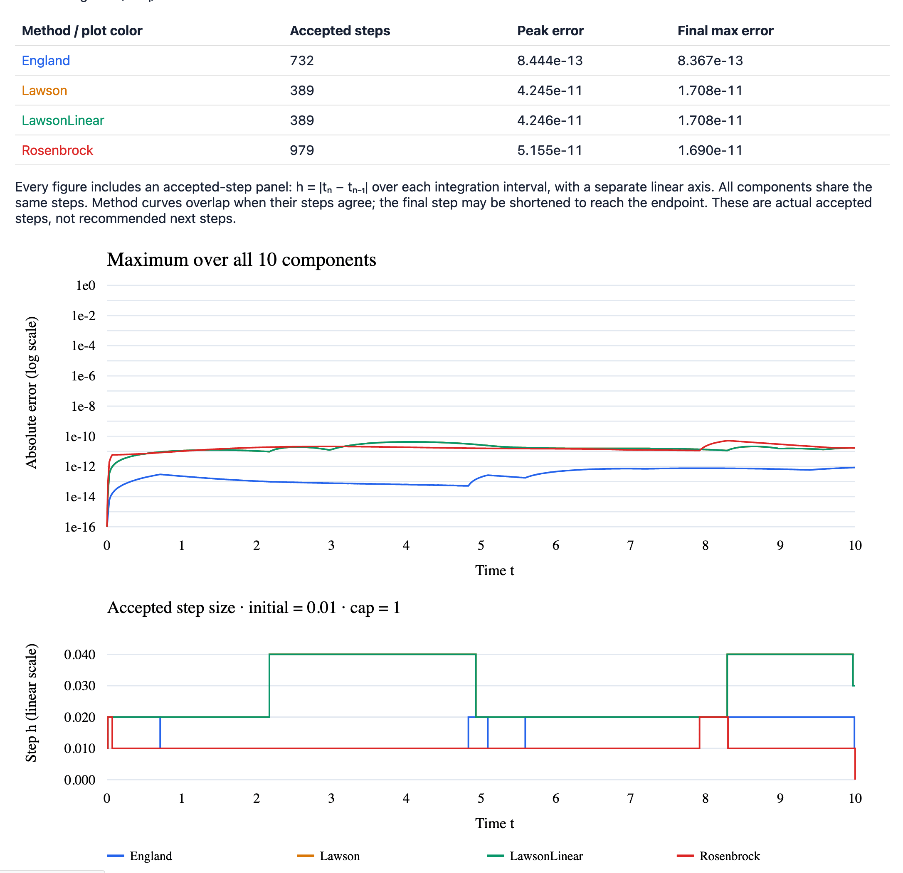

## Precision comparison: four ten-equation systems

```bash
cargo run --locked --release --example precision
```



*Precision and step adaptation*


The [`precision` example](examples/precision.rs) solves a ten-equation system
of each Type 1–4 with every compatible method (15 runs). It opens
`target/precision/index.html`, an offline report with four overview plots and
40 component plots comparing absolute numerical error against exact solutions.
Each plot overlays the compatible methods on the same logarithmic error scale.
Every figure also includes a step-size panel with its own linear axis,
showing the actual accepted $h_n=|t_n-t_{n-1}|$ over each integration interval.
The step sizes are shared by all components; method curves overlap when their
steps agree. Any shortened final step is included. Recommended next steps are not
used in these plots.
Expandable sections show the individual components; the report includes step
counts, peak and final errors, downloadable SVG plots, and `errors.csv` with
every numerical value, exact value, and absolute error at accepted times.

For Types 1, 3, and 4, let $i=0,\ldots,9$, $j=(i+1)\bmod 10$,
$\omega_i=0.2+0.02i$, and $q_i(t)=2+\sin(\omega_i t)$.
The exact solution is $x_i(t)=q_i(t)$, with $x_i(0)=2$:

- **Type 1:** $x_i'=q_i'-(1+0.1\sin t)(x_i-q_i)+0.05(x_j-q_j)^2$.
- **Type 3:** $x_i'=-(1+0.1\sin t)x_i+0.1x_j+\varphi_i(t)$,
  where $\varphi_i=q_i'+(1+0.1\sin t)q_i-0.1q_j$.
- **Type 4:** $(Bx)_i=-x_i+0.1x_j$ and
  $u_i=q_i'+q_i-0.1q_j+0.05(x_j-q_j)^2$.

Substituting $x_i=q_i$ cancels the correction terms in each system.
Type 2 consists of five nonlinear oscillator pairs. For $k=0,\ldots,4$,
write $a=x_{2k}$, $b=x_{2k+1}$, and $\omega=0.2+0.04k$:

$$
\begin{aligned}
a' &= -\omega b + 0.1(1-a^2-b^2)a, \\
b' &= \omega a + 0.1(1-a^2-b^2)b.
\end{aligned}
$$

The exact solution is $a(t)=\cos(\omega t)$, $b(t)=\sin(\omega t)$,
starting from $(a,b)=(1,0)$. The nonlinear terms vanish on the unit circle.

All runs integrate over $[0,10]$ with initial step $0.01$, maximum step $1$,
and local tolerance $10^{-12}$, retaining adaptive rejection and the default
relative/absolute error control. The controller can increase or decrease the
step size; there is no target step count. The example checks that each run
reaches the endpoint with peak absolute error below $10^{-3}$.
This is an accuracy comparison under common controls, not an equal-cost
benchmark or a general ranking of methods. Errors below $10^{-16}$ are clipped
only in the plots; near machine precision, evaluation of the exact solution
also contributes rounding error.

```bash
cargo run --locked --release --example precision -- --no-open
cargo run --locked --release --example precision -- --output target/my-precision
```

## Hello, world: a two-variable system

The minimal console demo in [`examples/hello_world.rs`](examples/hello_world.rs)
computes `x' = cos(y), y' = sin(x)` from `(0, 0)` over `t = 0..10`:

```bash
cargo run --example hello_world
```

The complete app is:

```rust
use cauchy_ode::{OdeSystem, Solver};

fn main() -> Result<(), Box<dyn std::error::Error>> {
    let system = OdeSystem::autonomous(&["x", "y"], &["cos(y)", "sin(x)"])?;
    // Start at (x, y) = (0, 0) and integrate from t = 0 to t = 10.
    let trajectory = Solver::default().solve_problem(&system, 0.0, &[0.0, 0.0], 10.0)?;

    println!("t,x,y");
    for (t, state) in trajectory.times.iter().zip(&trajectory.states) {
        println!("{t:.6},{:.6},{:.6}", state[0], state[1]);
    }
    Ok(())
}
```

This is a pair of coupled first-order ODEs with a two-dimensional state.
`autonomous` means the equations do not explicitly depend on time. The default
solver is England; the output contains the initial point and every accepted
adaptive step, including the endpoint, as `t,x,y` rows. No plotting code or
additional dependencies are needed. Building requires a Fortran compiler as
described under [Building](BUILDING.md).

## Lorenz butterfly demo

```sh
cargo run --release --example lorenz
```

Computes the classic Lorenz system from `(1, 1, 1)` and opens an interactive,
offline viewer at `target/lorenz.html`. Drag to rotate, scroll to zoom, switch
coordinate projections, replay or scrub the trajectory, and export PNG or CSV.
The Rust example computes every point with cauchy-ode; the viewer renders those
points and requires no external JavaScript libraries or network access.

```sh
cargo run --release --example lorenz -- --method rosenbrock-autonomous --duration 80
cargo run --release --example lorenz -- --no-open --output target/butterfly.html
```

Supported demo methods: `england` (default), `lawson`, `rosenbrock`, and
`rosenbrock-autonomous`. Different numerical methods can produce different
long-term trajectories in this chaotic system. The plot hides an initial
transient by default; uncheck **Hide transient** to display the complete path.

## Rössler ribbon demo

```sh
cargo run --release --example rossler
```

Solves `x' = -y-z`, `y' = x+0.2*y`, `z' = 0.2+z*(x-5.7)` from `(1, 1, 1)`
over 300 time units and opens `target/rossler.html`. The initial 50 time units
are hidden by default to show the developed attractor. Its camera and scale
are set to reveal the spiral and its rising fold.

The Rössler and Lorenz demos share the same offline viewer, with 3D rotation,
coordinate projections, playback, zoom, and PNG/CSV export. The same options
are available for both:

```sh
cargo run --release --example rossler -- --method rosenbrock-autonomous --duration 400
cargo run --release --example rossler -- --no-open --output target/ribbon.html
```

## Halvorsen, four-wing, and Dadras attractor demos

Three additional autonomous systems use the same offline viewer, including
rotation, coordinate projections, playback, and PNG/CSV export:

```bash
cargo run --locked --release --example halvorsen
cargo run --locked --release --example four_wing
cargo run --locked --release --example dadras
```

Each opens `target/<example>.html`. Use `--no-open` to generate without opening
a browser, `--duration` to change the integration interval, and `--output` to
choose an HTML path. The supported methods are `england` (default), `lawson`,
`rosenbrock`, and `rosenbrock-autonomous`.

**Halvorsen — three curling lobes.** With $a=1.4$:

$$
\begin{aligned}
x' &= -ax-4y-4z-y^2, \\
y' &= -ay-4z-4x-z^2, \\
z' &= -az-4x-4y-x^2.
\end{aligned}
$$

Integrates from $(-8.6807408,-2.4741399,0.070775762)$ over $[0,150]$,
hiding the first 20 time units. The default camera looks along the symmetry
axis to reveal the three lobes.
[Equations and initial state](https://juliadynamics.github.io/PredefinedDynamicalSystems.jl/stable/#PredefinedDynamicalSystems.halvorsen).

**Four-wing — four sweeping wings.** This specific variant uses:

$$
\begin{aligned}
x' &= 0.2x+yz, \\
y' &= -0.01x-0.4y-xz, \\
z' &= -z-xy.
\end{aligned}
$$

Integrates from $(0.1,0.1,0.1)$ over $[0,2000]$, hiding the first 100 time
units. The longer interval traces the slowly evolving wings.
[Equations and parameter set](https://analogparadigm.com/downloads/alpaca_45.pdf).

**Dadras–Momeni — interwoven scrolls.** The three-scroll parameter set gives:

$$
\begin{aligned}
x' &= y-3x+2.7yz, \\
y' &= 1.7y-xz+z, \\
z' &= 2xy-9z.
\end{aligned}
$$

Integrates from $(2.5,0,-1.5)$ over $[0,300]$, hiding the first 20 time units.
[Dadras and Momeni (2009)](https://doi.org/10.1016/j.physleta.2009.07.088)
and [equation catalogue](https://el3ssar.github.io/TSDynamics/systems/ode/chaotic-attractors/Dadras/).

## Thomas labyrinth demo

```sh
cargo run --release --example thomas
```

Solves `x' = sin(y)-0.208*x`, `y' = sin(z)-0.208*y`, and
`z' = sin(x)-0.208*z` for 500 time units and opens `target/thomas.html`.
The initial state `(1, 0, 0)` breaks the symmetry: equal initial coordinates
would stay on the diagonal `x=y=z`. The viewer hides the first 100 time units
by default and uses a centered 3D view with a color scale spanning negative
and positive z. Rotation, projections, replay, and PNG/CSV export work as in
the other demos.

```sh
cargo run --release --example thomas -- --method rosenbrock-autonomous
cargo run --release --example thomas -- --no-open --output target/labyrinth.html
```

## Aizawa vortex demo

```bash
cargo run --release --example aizawa
```

Integrates the following system from `(0.1, 0, 0)` for 300 time units and opens
`target/aizawa.html` in the shared offline, interactive 3D viewer:

```text
x' = (z - 0.7)x - 3.5y
y' = 3.5x + (z - 0.7)y
z' = 0.6 + 0.95z - z³/3 - (x² + y²)(1 + 0.25z) + 0.1zx³
```

Equations and parameters follow the
[Chaotic Motion reference implementation](https://nbodyphysics.com/chaoticmotion/html/_aizawa_8cs_source.html).
The sidebar uses the equivalent parameterized form, with all six constants shown.
The viewer hides the first 20 time units by default; uncheck “Hide transient” to
see the initial approach. Rotation, replay, projections, PNG and CSV exports are
available, just as in the other demos.

```bash
cargo run --release --example aizawa -- --method rosenbrock-autonomous --duration 150
cargo run --release --example aizawa -- --no-open --output target/aizawa.html
```
