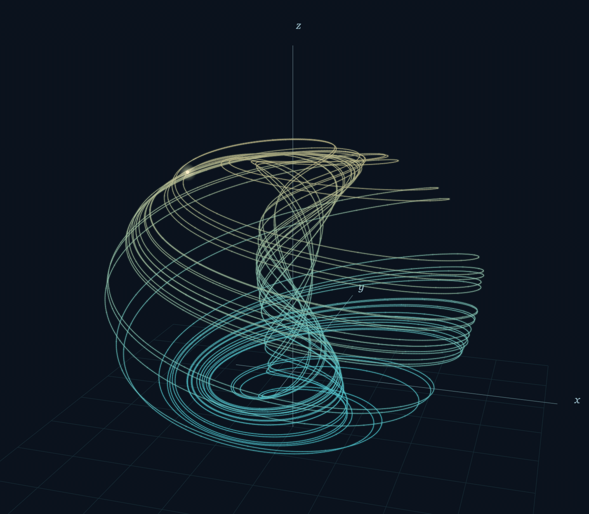

# cauchy-ode

[](https://github.com/drnikolaev/Cauchy/actions/workflows/quality.yml)
[](https://github.com/drnikolaev/Cauchy/actions/workflows/ubuntu-x86_64.yml)
[](https://github.com/drnikolaev/Cauchy/actions/workflows/ubuntu-arm64.yml)

Distributed under the [Boost Software License, Version 1.0](LICENSE).

Write equations naturally in Rust, with symbolic Jacobians and adaptive stiff solvers.



*Aizawa attractor computed by cauchy-ode*

`cauchy-ode` numerically solves **Cauchy's initial value problem** for ordinary
differential equations and systems: find a trajectory `x(t)` satisfying
`x'(t) = f(t, x(t))` with the prescribed initial condition `x(t0) = x0`.
Here `x` may be a scalar or a vector of state variables. See Wikipedia's
[Initial value problem](https://en.wikipedia.org/wiki/Initial_value_problem)
for the mathematical formulation.

The Cargo package is named `cauchy-ode`. Rust identifiers cannot contain dashes,
so Cargo exposes the library as `cauchy_ode`: imports use `use cauchy_ode::...`.

`Solver` integrates expressions with the adaptive England, Lawson, and
Rosenbrock methods. Build with Cargo and a Fortran compiler: Intel `ifx` on
Windows, or `gfortran` on Linux/macOS. Linking uses Intel oneMKL on Windows,
Accelerate on macOS, and BLAS/LAPACK on Linux. See [Building](BUILDING.md).

## Building

See [Building instructions](BUILDING.md) for Windows, Linux, and macOS setup.

## Library usage

```rust
use cauchy_ode::Solver;

fn main() {
    // x' = t + sqrt(x), x(1) = 1, integrate to t = 2.
    let solution = Solver::default()
        .solve("t+sqrt(x)", 1.0, 1.0, 2.0)
        .expect("ODE integration failed");
    let final_x = solution.states.last().unwrap()[0]; // approximately 4
    println!("x(2) = {final_x}");
}
```

`solve(rhs, start_time, initial_x, end_time)` accepts `t` and `x` in the RHS.
For systems, use one expression per component and zero-based variable names:

```rust
use cauchy_ode::Solver;

fn main() {
    // x0' = x1, x1' = -x0.
    let solution = Solver::default().solve_system(
        &["x1", "-x0"], 0.0, &[1.0, 0.0], std::f64::consts::TAU,
    ).expect("ODE integration failed");
    println!("Final state: {:?}", solution.states.last().unwrap());
}
```


Choose an algorithm with the `method` field. 
England remains the default. 
**For stiff systems Rosenbrock is recommended.**

The four system types below share the initial condition $x(t_0) = x_0$,
where $x(t) \in \mathbb{R}^n$ is the state vector.

**Type 1 — General systems** (`OdeSystem::general`):

$$
\frac{dx}{dt} = f(t, x).
$$

**Type 2 — Autonomous systems** (`OdeSystem::autonomous`), with no explicit
dependence on time:

$$
\frac{dx}{dt} = f(x).
$$

**Type 3 — Linear systems** (`OdeSystem::linear`):

$$
\frac{dx}{dt} = A(t)x + \varphi(t).
$$

Here $A(t)$ is an $n \times n$ matrix and $\varphi(t)$ is a forcing vector;
both depend only on time.

**Type 4 — Systems with a constant linear part** (`OdeSystem::split`):

$$
\frac{dx}{dt} = Bx + u(t, x).
$$

Here $B$ is a constant $n \times n$ matrix and $u(t, x)$ is a nonlinear
remainder, expected to be relatively small.

- **England:** Runge–Kutta process modification developed by R. England. A fast
  and precise fifth-order method suitable for solving systems of Type 1.
  See [[1]](#reference-1).
- **Lawson:** Exponential method modification developed by J. D. Lawson.
  Recommended for linear and quasi-linear systems of Types 1, 3, and 4,
  including stiff ones. The method is A-stable for linear systems: stability
  does not impose an upper step-size limit for decaying linear test modes.
  Accuracy still depends on step size. See [[2]](#reference-2).
- **Rosenbrock:** Implicit process developed by H. H. Rosenbrock. Recommended
  for nonlinear systems of Types 1 and 2, including stiff ones.
  See [[3]](#reference-3).

| Method | Fortran routine | System constructor | Required callbacks |
|---|---|---|---|
| `England` | `SENGL` | Any | RHS |
| `Lawson` | `SLOUN` | Any | RHS, symbolic Jacobian |
| `LawsonLinear` | `SLOUI` | `OdeSystem::linear` | A(t), phi(t) |
| `LawsonSplit` | `SLOUU` | `OdeSystem::split` | u(t,x), constant B |
| `Rosenbrock` | `SROSN` | Any | RHS, symbolic Jacobian, partial time derivative |
| `RosenbrockAutonomous` | `SROSA` | `OdeSystem::autonomous` | RHS, symbolic Jacobian |

For custom variable names and reusable parsed systems:

```rust
use cauchy_ode::{Method, OdeSystem, Solver};

fn main() {
    let system = OdeSystem::general("time", &["position", "velocity"], &[
        "velocity", "-position - 0.1*velocity + sin(time)",
    ]).unwrap();
    let solver = Solver { method: Method::Rosenbrock, ..Solver::default() };
    let solution = solver.solve_problem(&system, 0.0, &[1.0, 0.0], 10.0).unwrap();
    println!("Final state: {:?}", solution.states.last().unwrap());
}
```

`OdeSystem::new` and `OdeSystem::new_with_parameters` remain available as
compatibility aliases for `general` and `general_with_parameters`.

`OdeSystem::autonomous(&["x", "y"], &["y", "-x"])` declares a time-independent
system. For the convenience `solve` and `solve_system` methods, selecting
`RosenbrockAutonomous` declares the expressions autonomous and rejects `t`.
Unknown variables and incompatible method/system combinations are errors.
The scalar convenience methods accept both `x` and `x0`; they refer to the
same component, including when calculating its derivatives.

`OdeSystem` itself has **no implicit aliases**: state and time names are exactly
those declared in its constructor. For example, a system declaring only `x0`
rejects undeclared `x`. You can name time `clock` or even `x`, or use `t` as a
state name when time has another name. Names must be valid, distinct identifiers.

### Named constant parameters

Use the `_with_parameters` constructors to bind constants before name validation
and symbolic differentiation:

```rust
use cauchy_ode::{OdeSystem, Solver};

fn main() {
    let system = OdeSystem::general_with_parameters(
        "clock",
        &["position", "velocity"],
        &["velocity", "-stiffness*position-damping*velocity+sin(clock)"],
        &[("stiffness", 4.0), ("damping", 0.2)],
    ).unwrap();
    let trajectory = Solver::default()
        .solve_problem(&system, 0.0, &[1.0, 0.0], 10.0)
        .unwrap();
    println!("Final state: {:?}", trajectory.states.last().unwrap());
}
```

Bindings are `&[(&str, f64)]`. Values must be finite; parameter names must be valid
identifiers, unique, and distinct from state/time names. Missing bindings are
errors; unused bindings are allowed so a shared configuration can serve multiple
systems. Substitution operates on expression trees, not text, and does not alter
longer names or function calls. Values are copied into the system: rebuild it
with new bindings to change parameters.

The four constructors are `general_with_parameters`, `autonomous_with_parameters`,
`linear_with_parameters`, and `split_with_parameters`; the existing constructors
remain available without bindings. Linear bindings apply to both the matrix and
forcing. The parameterized split constructor takes **matrix expression strings**
instead of the numeric matrix accepted by `split`:

```rust
fn main() {
    let _system = cauchy_ode::OdeSystem::split_with_parameters(
        "clock", &["amount"], &["-rate"], &["-loss*amount^2"],
        &[("rate", 2.0), ("loss", 1.0)],
    ).unwrap();
}
```

After substitution, its matrix must evaluate to finite constants; the remainder
may still depend on time and state. Parameters are numeric constants, not
runtime variables or expressions depending on other parameters.

For `x' = A(t)x + phi(t)`, supply matrix entries and forcing as expressions:

```rust
use cauchy_ode::{Method, OdeSystem, Solver};

fn main() {
    // Column-major A(t) = [[-2, t], [0, -3]].
    let system = OdeSystem::linear("t", &["x", "y"],
        &["-2", "0", "t", "-3"], &["sin(t)", "0"]).unwrap();
    let solver = Solver { method: Method::LawsonLinear, ..Solver::default() };
    let solution = solver.solve_problem(&system, 0.0, &[1.0, 0.0], 2.0).unwrap();
    println!("Final state: {:?}", solution.states.last().unwrap());
}
```

For `x' = Bx + u(t,x)`, supply constant matrix entries and remainder expressions:

```rust
use cauchy_ode::{Method, OdeSystem, Solver};

fn main() {
    let system = OdeSystem::split("t", &["x", "y"],
        &[-100.0, 0.0, 2.0, -3.0], &["sin(t)-x^3", "x*y"]).unwrap();
    let solver = Solver { method: Method::LawsonSplit, ..Solver::default() };
    let solution = solver.solve_problem(&system, 0.0, &[1.0, 0.0], 2.0).unwrap();
    println!("Final state: {:?}", solution.states.last().unwrap());
}
```

All matrices, including Jacobian callbacks, use Fortran column-major order:
index `column * dimension + row`. The supplied `SLOUI` implements `phi(t)`,
whereas [the old manual's Type 3 formula](https://cvmlib.com/runge/help_en/index_ense1.html#x2-40001.3)
shows `phi(x)` - that is a typo actually. State-dependent forcing is rejected by `linear`; represent that
case with the complete RHS in `OdeSystem::general` and select general Lawson.

The result contains the initial point and every accepted adaptive step in
`times` and `states`, including the requested endpoint. `recommended_steps`
stores the signed initial step and the recommended next step after each accepted
step, matching the old product's solution table. Actual step lengths are the
differences between successive times. Earlier end times integrate backward.
Configure `initial_step`, `min_step`, `max_step`, `tolerance`,
`relative_threshold`, and `max_steps` on `Solver`. Tolerance is a local error
criterion, not a bound on global error. The final step may be shorter than
`min_step` to reach the endpoint.

## Runge's principle (step doubling).

Starting from the same numerical state at
time `t`, compute `x1` with one step of length `h` and `x2` with two consecutive
steps of length `h/2`, both ending at `t+h`. For a method of order `p`, the
leading local errors are proportional to `h^(p+1)` and
`2*(h/2)^(p+1) = h^(p+1)/2^p`, respectively. Eliminating the unknown leading
coefficient gives the local error estimate for the **two-half-step result**:
`E ≈ ||x2-x1||∞/(2^p-1)`. For fifth-order step doubling, such as applying this
principle to England's fifth-order method, the denominator is `2^5-1 = 31`;
for a scalar equation, the norm reduces to absolute value. The corresponding
estimate for the one-full-step result is `2^p*E`. This is an asymptotic estimate
for sufficiently smooth solutions and sufficiently small steps, not a rigorous
upper bound or a bound on accumulated global error. It supplies a discrepancy
for adaptive step acceptance and rejection. See [[4]](#reference-4),
Section 1.3.1, equations (15)–(20).

Implementation note: the current Lawson and Rosenbrock routines explicitly use
step doubling with `CRUNGE = 1/15 = 1/(2^4-1)` and retain the two-half-step
result. `SENGL` instead computes its discrepancy from a weighted combination of
shared England stages; it does not perform the full-step/two-half-step comparison
above. The routines use the maximum absolute component of the discrepancy,
dividing by the maximum absolute solution component when that amplitude reaches
`relative_threshold`, before comparing against `tolerance`. 

## Symbolic computations for bodies and their derivatives

Expressions are parsed when the system is created. Symbolic computation trees
are prepared once per solve, and the variable map is reused by callbacks.
The existing `MathExpr` differentiation rules apply, including piecewise
functions; callers should choose equations whose required derivatives exist
along the integration stages.

All callbacks carry an opaque Rust context, call `MathExpr::evaluate`, and
return an error status. No global callback state is used. Every step routine
and callback takes `PC` (pointer to context) as its first argument, passing `TYPE(C_PTR)` by
reference. Callback signatures are declared in `ftn/solver_callbacks.f90`.
The new routines export `cauchy_ode_sloun`, `cauchy_ode_sloui`, `cauchy_ode_slouu`,
`cauchy_ode_srosn`, and `cauchy_ode_srosa`. Their callbacks and Lawson step helpers
 include an `IERR` output argument; failures return immediately.

`MEXP` and `INV` adapters call the existing matrix exponential and inverse
implementations, and `MPP` adds the identity for Rosenbrock's `I-h*J` matrix.
Parse/evaluation errors, non-finite values, step limits and time stagnation
return `SolverError`. Fortran status 65 indicates a minimum-step tolerance
failure. Matrix exponential errors use `1000 + abs(INFO)` (1003 also covers
non-finite matrices), and inverse errors use `2000 + abs(INFO)`; negative
statuses -1000 and -2000 indicate allocation and non-finite inverse data errors.
These statuses are preserved in `SolverError::FortranFailure`, including a
singular Rosenbrock stage matrix, rather than being overwritten with 65.


## Stiff system regression tests

```bash
cargo test --test stiff_systems -- --nocapture
```

[`tests/stiff_systems.rs`](tests/stiff_systems.rs) exercises three multiscale
problems. Here “sub-linear” is interpreted as the project's **semilinear split**
form `x' = Bx + u(t,x)`, not a sublinear-growth condition on `u`.

| Problem | Equations and initial state | Jacobian eigenvalues |
|---|---|---|
| Constructed coupled linear decay | `x'=-1e9*x+999999999*y`, `y'=-y`, `z'=-1e-9*z`; `(2,1,1)` | Exactly `{-1e9,-1,-1e-9}` |
| Kaps, semilinear (`epsilon=1e-9`) | `x'=-1000000002*x+1e9*y²`, `y'=x-y-y²`; `(1,1)` | Approximately `{-1e9,-1}` along the exact trajectory |
| Robertson, nonlinear kinetics | `x'=-0.04*x+1e4*y*z`, `y'=0.04*x-1e4*y*z-3e7*y²`, `z'=3e7*y²`; `(1,0,0)` | State-dependent; nonzero-mode ratio exceeds `1e12` near the tested endpoint; mass conservation supplies a zero mode |

The linear test checks every accepted point against
`(exp(-1e9*t)+exp(-t), exp(-t), exp(-1e-9*t))` on `[0,1]`, including the fast
initial layer. The ultraslow component is almost constant on this interval.
All five Lawson/Rosenbrock variants pass; explicit England is checked for
step-budget exhaustion instead.

[Kaps' benchmark and exact solution](https://parallel-in-time.org/pySDC/coverage/z_91faa57f8583c837_odeSystem_py.html)
give `(exp(-2*t),exp(-t))`; both Rosenbrock variants are checked against this
throughout `[0,1]`. Its split uses
`B=[[-1000000002,0],[1,-1]]` and `u=[1e9*y²,-y²]`.
**Known limitation:** both split and general Lawson exhaust the deliberately
bounded step budget at this stiffness. In particular, this split leaves a large
derivative in the explicit nonlinear remainder; a stiff constant matrix alone
does not guarantee an efficient split.

For [Robertson kinetics](https://github.com/LLNL/sundials/blob/main/examples/cvode/serial/cvRoberts_dns.c),
both Rosenbrock variants reach `t=4e10` and are compared against SUNDIALS'
independently computed reference values, including the tiny intermediate
concentration. Every accepted state is checked for mass conservation and
nonnegative concentrations within numerical tolerance. General Lawson's
step-budget limitation at the requested tight tolerance is also recorded.

Tests check finite, increasing times, Jacobian eigenvalue separation, and steps
well beyond the fastest time scale—not just successful return codes. Eigenvalue
separation is a useful stiffness indicator, not a complete definition: trajectory,
interval, and stability restrictions also matter. These tests do not change the
solver algorithms or assert that every method is efficient on every stiff system.

## Bibliography

<a id="reference-1"></a>

[1] R. England. *Error Estimates for Runge-Kutta Type Solutions to Systems of
Ordinary Differential Equations*. Research and Development Department, Pressed
Steel Fisher Ltd., Cowley, Oxford, UK. October 1968.

<a id="reference-2"></a>

[2] J. D. Lawson. *Generalized Runge-Kutta Processes for Stable Systems with
Large Lipschitz Constants*. SIAM Journal on Numerical Analysis, 1967, vol. 4,
no. 3.

<a id="reference-3"></a>

[3] H. H. Rosenbrock. *Some General Implicit Processes for the Numerical Solution
of Differential Equations*. The Computer Journal, vol. 5 (1963), pp. 329–330.

<a id="reference-4"></a>

[4] *Ordinary Differential Equations*, Section 1.3.1, “Step doubling (Runge's
principle),” p. 4. Aarhus University, Practical Programming and Numerical
Methods course notes, 2025.
[PDF](https://users-phys.au.dk/~fedorov/prog/2025/book/ode.pdf#page=4).
